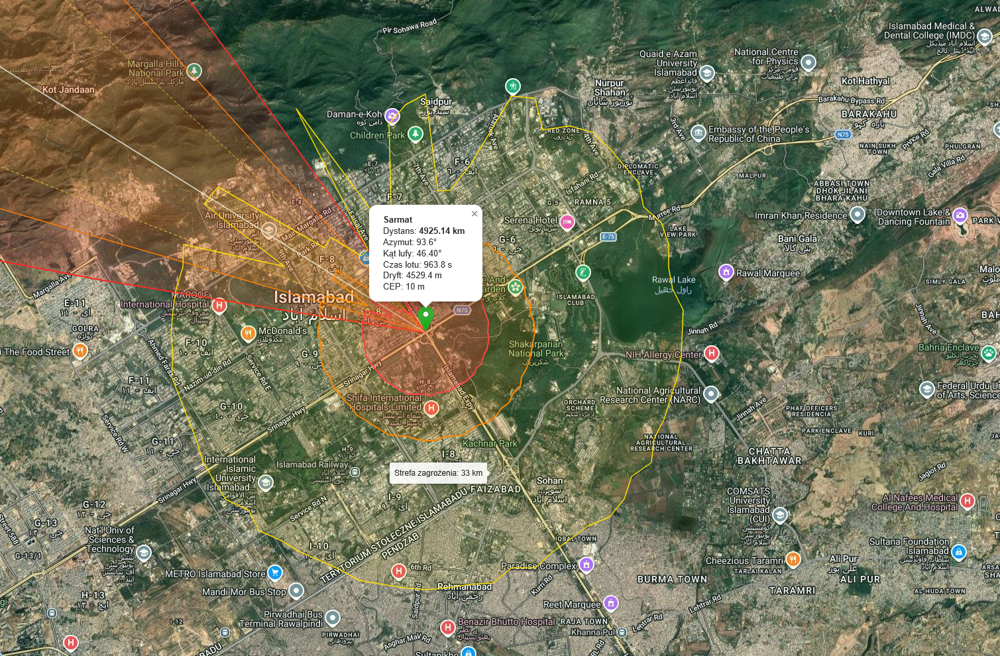
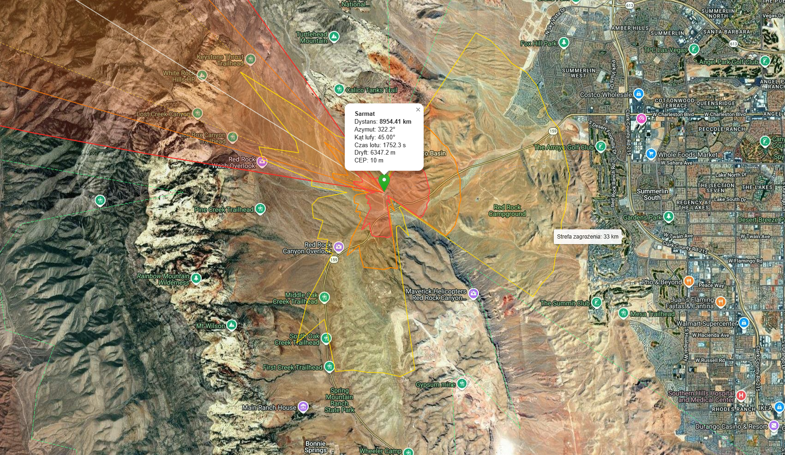
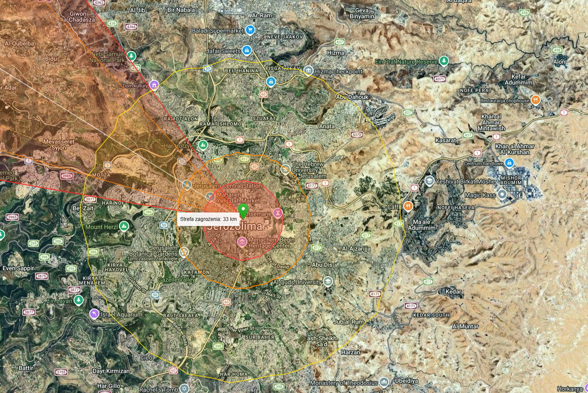
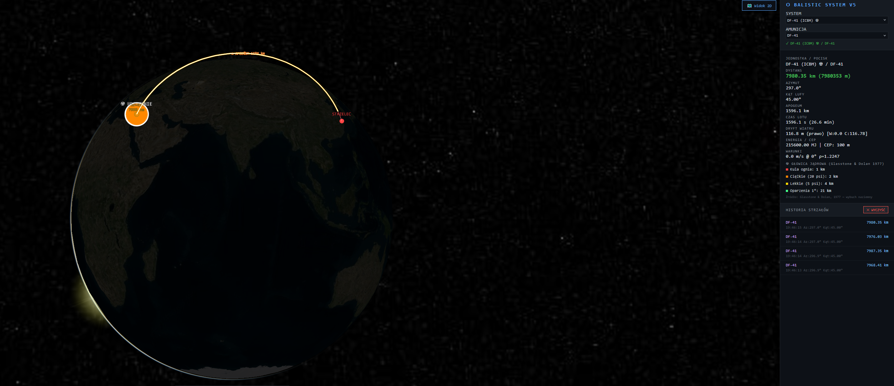

# ⬡ BALISTIC V6.0

### Advanced Ballistic Fire Control Simulator / Zaawansowany Symulator Balistyczny

[](https://img.shields.io/badge/license-MIT-blue)
[](https://img.shields.io/badge/Python-3.10+-green)
[](https://img.shields.io/badge/C%23-.NET%2010-purple)
[](https://img.shields.io/badge/Redis-7.x-red)
[](https://img.shields.io/badge/CesiumJS-1.114-orange)
[](https://img.shields.io/badge/Leaflet-1.9.4-brightgreen)
[](https://img.shields.io/badge/weapon%20systems-195-darkred)
[](https://img.shields.io/badge/SRTM-global%20coverage-blue)

> 🇬🇧 A ballistic fire control simulator featuring **NASA SRTM terrain masking** (real elevation data, horizon scan algorithm), **asymmetric blast zones** blocked by real mountains, nuclear blast zones, radioactive fallout, cluster munitions, Coriolis effect and hybrid ballistic model. Built as microservices: Python/Flask + C#/.NET + Redis Streams.

> 🇵🇱 Symulator balistyczny z **maskowaniem terenowym NASA SRTM** (rzeczywiste dane wysokościowe, algorytm horizon scan), **asymetrycznymi strefami rażenia** blokowanymi przez prawdziwe góry, strefami jądrowymi, opadem radioaktywnym, głowicami kasetowymi, efektem Coriolisa i hybrydowym modelem balistycznym. Architektura mikrousług: Python/Flask + C#/.NET + Redis Streams.

---

## 📷 Screenshots

| | |
|---|---|
|  🏔️ **Islamabad** — Margalla Hills block blast wave NW, flat plain unobstructed SE |  🏜️ **Las Vegas / Red Rock Canyon** — canyon walls clip zones west, city open east |
|  🕌 **Jerusalem** — Judean Desert extends zones east, Judean Hills clip west |  🌍 **DF-41 ICBM** — CesiumJS 3D globe trajectory |

---

## 🆕 What's New in v6.0

| Feature | Description |
|---|---|
| ⛰️ **NASA SRTM Terrain Masking** | Real elevation data (90m resolution) — 72-ray horizon scan algorithm, blast zones blocked by actual mountains |
| 🌍 **Global SRTM Coverage** | ~5700 tiles, full world 60°S–60°N offline cache (`srtm_cache/`) |
| 🔭 **Horizon Scan Algorithm** | For each of 72 rays: scans terrain profile, detects shadow zones behind ridges |
| 📐 **Asymmetric Blast Zones** | Zones expand freely through valleys, contract against mountain faces |
| 🏔️ **Elevation Display** | Impact point elevation shown in panel (e.g. `⛰️ SRTM (1340m n.p.m.)`) |
| 🌬️ **Fallout Polygon Fix** | Corrected azimuth→lat/lon conversion — proper wind-aligned elliptical plume |
| 🚀 **Hybrid Ballistic Model** | SRBM: Euler+ISA physics; ICBM/IRBM: analytic formulas calibrated to SIPRI/CSIS data |
| 📊 **Realistic ICBM Data** | Sarmat 9000km: 29.9min, apogee 1080km ✓ / MM-III 8000km: 28.4min, apogee 960km ✓ |
| 🗃️ **weapons_db.json** | Full weapon database externalized — 195 systems, all parameters |

---

## 🛠️ Technology Stack

| Technology | Role |
|---|---|
| **Python 3.10+ / Flask** | REST API, SRTM terrain masking, weather, heartbeat, PDF export |
| **C# / .NET 10** | Ballistic processor — hybrid Euler+analytic model, ISA atmosphere, Coriolis |
| **Redis 7.x Streams** | Microservices queue (`XADD`/`XREAD`) + heartbeat |
| **NASA SRTM** | Real elevation data via srtm.kurviger.de — 90m global DEM |
| **srtm_module.py** | Horizon scan terrain masking — auto-downloads tiles on demand |
| **Leaflet.js 1.9.4** | 2D satellite map — irregular GeoJSON blast polygons |
| **CesiumJS 1.114** | 3D globe — animated trajectories, Primitive API |
| **OpenStreetMap Overpass** | Fallback terrain density (when SRTM unavailable) |
| **Google Satellite** | High-res imagery, English labels |
| **OpenWeatherMap API** | Real-time wind, pressure, temperature |
| **ReportLab** | Automated PDF ballistic reports |

---

## ⚙️ Physics & Science

| Source | Application |
|---|---|
| **Glasstone & Dolan (1977)** | Nuclear blast radii — fireball, overpressure zones, thermal burns |
| **NATO FM 6-40** | Conventional HE blast zones |
| **ISA Standard Atmosphere** | Air density by altitude for trajectory simulation |
| **Haversine formula** | Accurate great-circle distance |
| **Euler integration (dt=1.0s)** | SRBM trajectory with air drag, Coriolis deflection |
| **SIPRI / CSIS / FAS** | ICBM calibration data — apogee ratios, flight times |
| **NASA SRTM** | Real elevation sampling for terrain masking horizon scan |

### Nuclear Physics — Glasstone & Dolan (1977)

```
Fireball:      r = 100  × W^0.41  [m]
Heavy (20psi): r = 290  × W^0.33  [m]
Light  (5psi): r = 690  × W^0.33  [m]
Burns (1°):    r = 2200 × W^0.41  [m]
```

### Hybrid Ballistic Model

```
SRBM / short MRBM (dist < maxRangeSim):
  → Full Euler+ISA simulation
  → FindElevationAngle bisection [45°–85°]
  → SimulateFlightTime with ISA density layers

ICBM / IRBM (dist > maxRangeSim):
  → Analytic formulas (calibrated SIPRI/CSIS/FAS):
  angle  = 45°
  apogee = dist × apogeeRatio  (0.06–0.13 by range)
  tof    = dist / (v0 × 0.70)  ← v_avg = 70% burnout velocity

Validation:
  ATACMS  165km, v0=1766: tof=134s  (2.2min), apogee=10km  ✓
  Iskander 500km, v0=2203: tof=324s  (5.4min), apogee=40km  ✓
  Sarmat  9174km, v0=7300: tof=1795s (29.9min), apogee=1101km ✓
  MM-III  8000km, v0=6700: tof=1706s (28.4min), apogee=960km  ✓
```

### SRTM Terrain Masking — Horizon Scan Algorithm

```
For each of 72 ray directions (0–360°):
  elev0 = SRTM elevation at impact point
  max_horizon = -999°

  For each sample s (0 to n_samples):
    d     = max_blast_radius × s / n_samples
    point = impact + d × direction
    elev  = SRTM.get_elevation(point)
    angle = atan2(elev - elev0, d)  ← elevation angle from impact

    if angle > max_horizon:
      max_horizon = angle           ← new horizon line
    elif max_horizon > 3° and angle < max_horizon - 3°:
      shadow_dist = d               ← terrain blocks wave here
      break

  ray_factor = shadow_dist / max_blast_radius  (0..1)

Polygon: each zone radius × ray_factor × small noise
Result: asymmetric polygon — contracted against ridges, expanded through valleys
```

---

## 🗺️ Features

- ⛰️ **NASA SRTM terrain masking** — real elevation data, horizon scan, asymmetric blast zones
- 🌍 **Global offline SRTM cache** — ~5700 tiles, auto-download on first shot in region
- 🏔️ **Elevation display** — impact point elevation shown in terrain panel
- 🌬️ **Radioactive fallout** — corrected wind-aligned elliptical plume, 3 intensity zones
- 🚀 **Hybrid ballistic model** — physics for SRBM, analytic for ICBM/IRBM
- 🛰️ **Map layer switcher** — Hybrid / Satellite / Road (English labels)
- 🎮 **Animated missile flight** — real-time trajectory with glowing trail
- ✈️ **Nuclear bomber aircraft** — animated, realistic altitude 9000-10000m
- 🎯 **Multi-target salvo** — mark multiple targets, fire simultaneously
- 💓 **Heartbeat monitor** — C# processor status, FIRE blocked if offline
- 🌀 **Coriolis effect** — real deflection based on shooter latitude
- 💥 **Irregular blast zones** — 72-ray polygon, terrain-aware
- ☢️ **Nuclear zones** — Glasstone & Dolan (1977)
- 💣 **Cluster munitions** — elliptical dispersion aligned with flight azimuth
- 📊 **Shot history** — click any shot → update results panel
- 📄 **PDF export** — full session ballistic report
- 🔐 **Session token** authorization
- 🎯 **GPS target search** — geocode address or coordinates → add as target

---

## 🌍 195 Systems from 30+ Countries

### 🇵🇱 Poland
| Category | Systems |
|---|---|
| Artillery | AHS KRAB 155mm (L52), M120 RAK 120mm, Leopard 2 120mm |

### 🇺🇸 USA
| Category | Systems |
|---|---|
| Artillery | M109A7 Paladin, M198, M777 |
| Missiles | ATACMS-A, HIMARS/GMLRS, PrSM, PAC-3 MSE, SM-3/6, Lance ☢, Pershing II ☢, GLCM ☢, Minuteman III ☢, Trident II D5 ☢, W76-2 ☢ |
| Cruise | Tomahawk, JASSM-ER, LRASM, AGM-86 ALCM ☢, AGM-183 ARRW (Mach 20) |
| Aircraft ✈️ | B-29 (Little Boy/Fat Man 1945), B-52 ☢, B-1B, F-35A ☢, B-2 Spirit ☢, B-21 Raider ☢, F-15E ☢ |

### 🇷🇺 Russia
| Category | Systems |
|---|---|
| Artillery | 2S19 Msta-S, 2S3 Akacja, 2S7 Pion (203mm), 2S35 Koalicja, 2S1 Gvozdika |
| Missiles | Iskander-M 9M723, Tochka-U, Scud-B, Kinżał, Rubezh ☢, Sarmat ☢, Bulava ☢, Sinewa ☢, Yars ☢, Topol-M ☢, Avangard ☢ |
| Cruise | Kalibr, Oniks, Zircon (Mach 9), Burevestnik ☢, Kh-101, Kh-102 ☢ |
| Aircraft ✈️ | Tu-160 Blackjack ☢, Tu-95 Bear ☢, Tu-22M Backfire ☢ |

### 🇨🇳 China
| Category | Systems |
|---|---|
| Missiles | DF-11A, DF-15B, DF-17, DF-21D, DF-26 ☢, DF-27 ☢, DF-31AG ☢, DF-41 ☢, DF-4 ☢, DF-5B ☢ |
| SLBM | JL-2 ☢, JL-3 ☢ |
| Cruise | CJ-10, YJ-12, DF-100, BrahMos, C-802 |
| Aircraft ✈️ | H-6K ☢ |

### Other Countries

| Country | Systems |
|---|---|
| 🇰🇵 N. Korea | KN-23, Hwasong-12/15/17/18 ☢, Pukguksong-3 ☢ |
| 🇮🇷 Iran | Fateh-110, Zolfaghar, Shahab-3, Khorramshahr, Fattah, Emad, Ghadr |
| 🇮🇱 Israel | Jericho II, Jericho III ☢ |
| 🇮🇳 India | Agni-V ☢, Agni-VI ☢, K-4 ☢, BrahMos |
| 🇵🇰 Pakistan | Shaheen-III ☢, Ababeel ☢, Ra'ad ☢ |
| 🇬🇧 UK | Storm Shadow, Trident II ☢, Avro Vulcan B2 ☢ ✈️ |
| 🇫🇷 France | M51 ☢, SCALP-EG, ASMP-A ☢, Rafale F3 ☢ ✈️ |
| 🇩🇪 Germany | PzH 2000, TAURUS KEPD 350, Tornado IDS ☢ ✈️ |
| 🇹🇷 Turkey | SOM, Bora, Kasirga |
| 🇰🇷 S. Korea | K9 Thunder, Hyunmoo-2C/3C/4/5 |
| 🇺🇦 Ukraine | Bohdana, Neptune, Vilkha, Hrim-2 |
| 🇸🇦 Saudi Arabia | CSS-5 ☢ |
| 🇸🇪 Sweden | Archer FH77BW, RBS-15 |

---

## 🏗️ Architecture

```
┌──────────────────────────┐    Redis Streams     ┌─────────────────────────┐
│    Python / Flask        │ ──────────────────►  │    C# Processor         │
│                          │  ballistics:stream   │                         │
│  - Leaflet 2D            │                      │  - Hybrid ballistic     │
│  - CesiumJS 3D globe     │ ◄──────────────────  │  - Euler+ISA (SRBM)     │
│  - SRTM terrain masking  │  ballistics:result   │  - Analytic (ICBM)      │
│  - srtm_module.py        │                      │  - ISA atmosphere       │
│  - Horizon scan          │   Redis Keys         │  - Coriolis effect      │
│  - /api/terrain route    │ ──────────────────►  │                         │
│  - /health heartbeat     │  processor:heartbeat └─────────────────────────┘
│  - PDF export            │
└──────────────────────────┘
         │
         ▼
  srtm_module.py
  ├── get_elevation()          — bilinear interpolation from HGT tile
  ├── terrain_shadowing_factor() — horizon scan per ray
  ├── compute_blast_radii_with_terrain() — 72-ray polygon generator
  └── srtm_cache/             — local tile cache (~16GB, gitignored)
```

---

## 🚀 Quick Start

```bash
git clone https://github.com/InsaneInfinity/Balistic.git
cd Balistic
pip install flask redis requests python-dotenv reportlab numpy srtm.py
```

Create `.env`:
```
WEATHER_API_KEY=your_openweathermap_key
CESIUM_TOKEN=your_cesium_ion_token
```

```bash
# Window 1 — C# processor
dotnet build
dotnet run

# Window 2 — Flask frontend
python balistic_input.py
```

Login: `admin` / `admin` → `http://127.0.0.1:5000`

### SRTM Setup (optional — tiles download automatically on first shot)

```bash
# Test SRTM module
python srtm_module.py

# Pre-download all world tiles (~16GB, ~3h)
python download_srtm_tiles.py
```

SRTM tiles cached in `srtm_cache/` (gitignored). First shot in new region = auto-download (~3s).

### Requirements
- Python 3.10+, .NET 10 SDK
- Redis 7.x ([Memurai](https://www.memurai.com/) for Windows)
- [OpenWeatherMap](https://openweathermap.org/api) API key (free)
- [Cesium Ion](https://ion.cesium.com) token (free)
- numpy, srtm.py (`pip install numpy srtm.py`)

---

## 🎮 Controls

| Action | Effect |
|---|---|
| **RMB** | Move shooter |
| **LMB** | Mark target |
| **FIRE** | Launch to all targets simultaneously |
| **🌍 3D** | Toggle CesiumJS globe |
| **🛰️ Layer** | Switch map layer |
| **🎯 GPS** | Search target by name or coordinates |
| **History click** | Zoom + update results panel |
| **⬇ PDF** | Export ballistic report |

---

## ⚠️ Disclaimer

> For **educational and simulation purposes only.**
> All data from publicly available sources: Glasstone & Dolan 1977, CSIS Missile Threat, Jane's, NATO FM 6-40, SIPRI, OSINT.
> Real fire control systems use significantly more complex models.

---

## 📜 License

MIT — use it, modify it, build on it.

---

## 🇵🇱 Polski

### Co nowego w v6.0

| Feature | Opis |
|---|---|
| ⛰️ **NASA SRTM** | Rzeczywiste dane wysokościowe (90m) — algorytm horizon scan, strefy blokowane przez prawdziwe góry |
| 🌍 **Globalne pokrycie SRTM** | ~5700 tile, cały świat 60°S–60°N w cache offline |
| 🔭 **Horizon Scan** | 72 promienie, skanowanie profilu terenu, wykrywanie stref cienia za grzbietami |
| 📐 **Asymetryczne strefy** | Strefy rozszerzają się przez doliny, kurczą przy zboczach |
| 🌬️ **Poprawiony opad** | Poprawiona konwersja azymut→lat/lon — właściwa elipsa zgodna z wiatrem |
| 🚀 **Hybrydowy model** | SRBM: fizyka Euler+ISA; ICBM/IRBM: wzory analityczne kalibrowane SIPRI/CSIS |
| 📊 **Realistyczne ICBM** | Sarmat 9000km: 29.9min, apogeum 1080km ✓ |
| 🗃️ **weapons_db.json** | Zewnętrzna baza 195 systemów |

### Uruchomienie

```bash
git clone https://github.com/InsaneInfinity/Balistic.git
cd Balistic
pip install flask redis requests python-dotenv reportlab numpy srtm.py
```

Utwórz `.env`:
```
WEATHER_API_KEY=twój_klucz_openweathermap
CESIUM_TOKEN=twój_token_cesium_ion
```

```bash
# Okno 1 — procesor C#
dotnet build && dotnet run

# Okno 2 — frontend Flask
python balistic_input.py
```

Login: `admin` / `admin` → `http://127.0.0.1:5000`

### SRTM (pobieranie automatyczne przy pierwszym strzale)

```bash
python srtm_module.py          # test modułu
python download_srtm_tiles.py  # opcjonalne: pobierz cały świat (~16GB, ~3h)
```

Tile w `srtm_cache/` (w .gitignore). Pierwszy strzał w nowy region = auto-pobranie (~3s).

### Zastrzeżenie

> System wyłącznie do celów **edukacyjnych i symulacyjnych**.
> Dane z jawnych źródeł: Glasstone & Dolan 1977, CSIS, Jane's, NATO FM 6-40, SIPRI, OSINT.

### Licencja

MIT — używaj, modyfikuj, rozwijaj.
