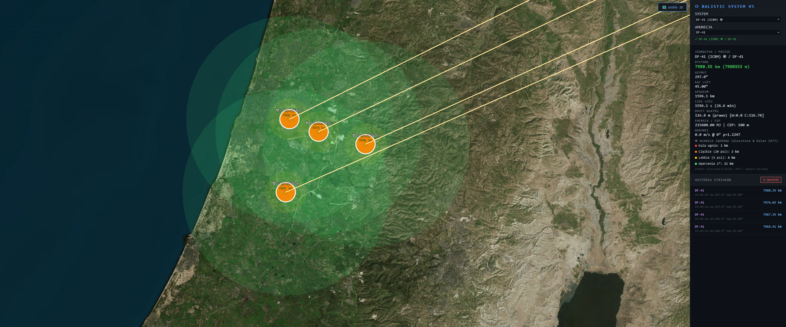
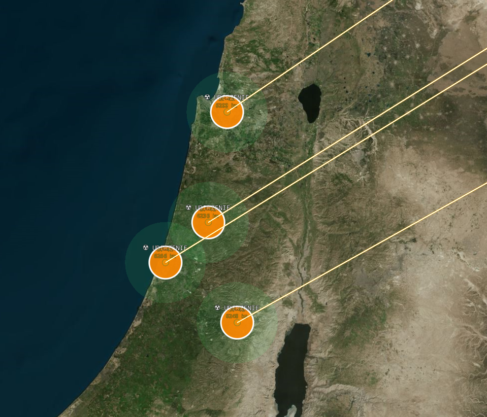

# ⬡ BALISTIC V5.11

### Advanced Ballistic Fire Control Simulator / Zaawansowany Symulator Balistyczny

[](https://img.shields.io/badge/license-MIT-blue)
[](https://img.shields.io/badge/Python-3.10+-green)
[](https://img.shields.io/badge/C%23-.NET%2010-purple)
[](https://img.shields.io/badge/Redis-7.x-red)
[](https://img.shields.io/badge/CesiumJS-1.114-orange)
[](https://img.shields.io/badge/Leaflet-1.9.4-brightgreen)
[](https://img.shields.io/badge/weapon%20systems-176-darkred)

> 🇬🇧 A ballistic fire control simulator featuring **terrain masking** (Cesium raycast), **urban canyon effect** (OSM street network analysis), nuclear blast zones, radioactive fallout, cluster munitions, nuclear bomber aircraft and Coriolis effect. Built as microservices: Python/Flask + C#/.NET + Redis Streams.

> 🇵🇱 Symulator balistyczny z **maskowaniem terenowym** (raycast Cesium), **efektem urban canyon** (analiza siatki ulic OSM), strefami rażenia jądrowego, opadem radioaktywnym, głowicami kasetowymi, nuklearnymi samolotami bombowymi i efektem Coriolisa. Architektura mikrousług: Python/Flask + C#/.NET + Redis Streams.

---

## 📷 Screenshots

| | |
|---|---|
|  🌍 DF-41 ICBM — CesiumJS 3D globe trajectory |  ☢️ 4× DF-41 simultaneous nuclear strikes |
|  🏔️ Terrain masking — blast zones blocked by Alpine ridges |  🏙️ Urban canyon effect — Warsaw street grid analysis |

---

## 🆕 What's New in v5.11

| Feature | Description |
|---|---|
| 🏔️ **Terrain Masking** | Cesium raycast — 72 rays × 25 samples per zone, blast wave blocked by mountains |
| 🏙️ **Urban Canyon Effect** | OSM street network analysis — blast channels along city streets, attenuates perpendicular |
| 🗺️ **Canvas Renderer** | `L.canvas()` explicit renderer — zero SVG DOM nodes, single batch draw call |
| 📦 **GeoJSON Batch** | All blast zones in one FeatureCollection → one canvas draw call per shot |
| 🎮 **Cesium Primitive API** | `GeometryInstance` batch → single GPU draw call for all 3D zones |
| 💾 **OSM Redis Cache** | `/osm_urban` proxy with 24h Redis TTL — rate limiting protection |
| 💓 **Heartbeat Monitor** | C# pings Redis every 2s → Flask `/health` → JS blocks FIRE if processor offline |
| ⚡ **Adaptive Raycast** | Auto-scales: >50km zones skip terrain (ICBM), >10km reduced 36×15, <2km full 72×25 |
| 🖱️ **PIP Hit-test** | Global point-in-polygon — click innermost blast zone, sorted by radius |

---

## 🛠️ Technology Stack

| Technology | Role |
|---|---|
| **Python 3.10+ / Flask** | REST API, OSM proxy, weather, heartbeat, PDF export |
| **C# / .NET 10** | Ballistic processor — Euler simulation, ISA atmosphere, Coriolis |
| **Redis 7.x Streams** | Microservices queue (`XADD`/`XREAD`) + OSM cache (TTL 24h) + heartbeat |
| **Leaflet.js 1.9.4** | 2D satellite map — canvas renderer, GeoJSON batch, PIP hit-test |
| **CesiumJS 1.114** | 3D globe — terrain sampling, Primitive API, animated trajectories |
| **OpenStreetMap Overpass** | Building density + street network for urban canyon analysis |
| **Google Satellite** | High-res imagery, English labels (`hl=en`, no Cyrillic) |
| **OpenWeatherMap API** | Real-time wind, pressure, temperature for ballistic corrections |
| **ReportLab** | Automated PDF ballistic reports |

---

## ⚙️ Physics & Science

| Source | Application |
|---|---|
| **Glasstone & Dolan (1977)** | Nuclear blast radii — fireball, overpressure zones, thermal burns |
| **NATO FM 6-40** | Conventional HE blast zones |
| **ISA Standard Atmosphere** | Air density by altitude for trajectory simulation |
| **Haversine formula** | Accurate great-circle distance |
| **Euler integration (dt=0.01s)** | Trajectory with air drag, Coriolis deflection |
| **Cesium terrain data** | Real elevation sampling for terrain masking raycast |
| **OSM Overpass API** | Building count (density) + road geometry (canyon angle histogram) |

### Nuclear Physics — Glasstone & Dolan (1977)

```
Fireball:      r = 100  × W^0.41  [m]
Heavy (20psi): r = 290  × W^0.33  [m]
Light  (5psi): r = 690  × W^0.33  [m]
Burns (1°):    r = 2200 × W^0.41  [m]
```

### Terrain Masking Algorithm

```
For each ray angle θ (0-360°, adaptive step):
  For each step s along ray (adaptive count):
    terrain_h = Cesium.sampleTerrainMostDetailed(point)
    wave_h    = zone_radius × 0.15 × (1 - (dist/radius)²) + epicenter_h
    if terrain_h > wave_h → ray blocked at dist × 0.85
  Apply urban canyon modifier: +30% along streets, -20% perpendicular

Adaptive resolution:
  zone > 50km  → SKIP terrain (ICBM, Sarmat) — canyon only
  zone > 10km  → 36 rays × 15 steps
  zone > 2km   → 54 rays × 20 steps
  zone ≤ 2km   → 72 rays × 25 steps (full precision)
```

### Urban Canyon Effect

```
OSM Query (parallel, Redis cache 24h):
  buildings → density = count / 300 (normalized 0-1)
  roads     → geometry → angle histogram (36 bins × 5°) + smoothing

Canyon modifier per ray:
  alignment = 1 - |ray_angle - canyon_angle| / 90
  modifier  = 1 + alignment × 0.30 × strength × density   (along street)
            + (1-alignment) × (-0.20) × strength × density  (perpendicular)
```

---

## 🗺️ Features

- 🏔️ **Terrain masking** — irregular blast zones blocked by real terrain elevation
- 🏙️ **Urban canyon effect** — toggle ON/OFF, OSM street analysis, 36-bin histogram
- 🛰️ **Map layer switcher** — Hybrid / Pure satellite / Road (English labels)
- 🚀 **Animated missile flight** — real-time trajectory with glowing trail
- ✈️ **Nuclear bomber aircraft** — animated emoji icons, realistic altitude 9000-10000m
- 🎮 **Animation controls** — Play/Pause/Reset, speed ×1/×10/×50/×100/×500
- 🌍 **Great circle trajectory** — geodesic path over Earth's curvature
- 🎯 **Multi-target salvo** — mark multiple targets, fire all simultaneously
- 💓 **Heartbeat monitor** — C# processor status in panel, FIRE blocked if offline
- 🔢 **Euler ballistics** — air resistance, ISA density, wind corrections
- 🌀 **Coriolis effect** — real deflection based on shooter latitude
- 💥 **Blast zones** — irregular GeoJSON polygons (canvas renderer)
- ☢️ **Nuclear zones** — Glasstone & Dolan (1977), meters/km display
- 🌬️ **Radioactive fallout** — wind-direction elliptical plume, 3 intensity zones
- 💣 **Cluster munitions** — elliptical dispersion aligned with flight azimuth
- 📊 **Shot history** — click any shot → update full results panel
- 📄 **PDF export** — full session ballistic data
- 🖱️ **PIP click** — click any blast zone → shows innermost zone data
- 🔐 **Session token** authorization

---

## 🌍 176 Systems from 30+ Countries

### 🇵🇱 Poland
| Category | Systems |
|---|---|
| Artillery | AHS KRAB 155mm, M120 RAK 120mm, Leopard 2 120mm, Krab (copy) |

### 🇺🇸 USA
| Category | Systems |
|---|---|
| Artillery | M109A7 Paladin, M198 |
| Missiles | ATACMS, HIMARS/GMLRS, PrSM, PAC-3 MSE, SM-3/6, Lance ☢, Pershing II ☢, GLCM ☢, Minuteman III ☢, Trident II D5 ☢, W76-2 ☢, THAAD |
| Cruise | Tomahawk, JASSM-ER, LRASM, AGM-86 ALCM ☢, AGM-183 ARRW (Mach 20) |
| Aircraft ✈️ | B-29 (Little Boy/Fat Man 1945), B-52 ☢, B-1B, F-35A ☢, B-2 Spirit ☢, B-21 Raider ☢, F-15E ☢ |

### 🇷🇺 Russia
| Category | Systems |
|---|---|
| Artillery | 2S19 Msta-S, 2S3 Akacja, 2S7 Pion (203mm), 2S35 Koalicja, 2S1 Gvozdika |
| Missiles | Iskander-M, Tochka-U, Scud-B, Kinżał, Rubezh ☢, Sarmat ☢, Bulava ☢, Sinewa ☢, Yars ☢, Topol-M ☢, Avangard ☢ |
| Cruise | Kalibr, Oniks, Zircon (Mach 9), Burevestnik ☢, Kh-101, Kh-102 ☢ |
| Aircraft ✈️ | Tu-160 Blackjack ☢, Tu-95 Bear ☢, Tu-22M Backfire ☢ |

### 🇨🇳 China
| Category | Systems |
|---|---|
| Artillery | PLZ-05, PCL-181 |
| Missiles | DF-11A, DF-15B, DF-17, DF-21D, DF-26 ☢, DF-27 ☢, DF-31AG ☢, DF-41 ☢, DF-4 ☢, DF-5B ☢, DF-ZF |
| SLBM | JL-2 ☢, JL-3 ☢ |
| Cruise | CJ-10, YJ-12, DF-100, C-802, C-705 |
| Aircraft ✈️ | H-6K ☢ |

### Other Countries

| Country | Artillery | Missiles / Cruise / Aircraft |
|---|---|---|
| 🇰🇵 N. Korea | Koksan M-1978 (170mm) | KN-23, Hwasong-12/15/17/18 ☢, Pukguksong-3 ☢ |
| 🇮🇷 Iran | Hoveyzeh (155mm), Raad (122mm) | Fateh-110, Zolfaghar, Shahab-3, Khorramshahr, Fattah (Mach 13+), Kheibar, Emad, Ghadr |
| 🇮🇱 Israel | ATHOS 2052, Soltam M-71 | Jericho II, Jericho III ☢ |
| 🇮🇳 India | ATAGS, Dhanush | Agni-V ☢, Agni-VI ☢, K-4 ☢, K-15 ☢, BrahMos |
| 🇵🇰 Pakistan | M109 | Shaheen-III ☢, Ababeel ☢, Ra'ad ALCM ☢ |
| 🇬🇧 UK | AS-90 | Storm Shadow, Trident II ☢, Harpoon, Avro Vulcan B2 ☢ ✈️ |
| 🇫🇷 France | CAESAR | M51 ☢, SCALP-EG, APACHE, ASMP-A ☢, Rafale F3 ☢ ✈️ |
| 🇩🇪 Germany | PzH 2000 | TAURUS KEPD 350, Tornado IDS ☢ ✈️ |
| 🇹🇷 Turkey | T-155 Firtina | SOM, Bora, Kasirga, J-600T, TRG-300 |
| 🇰🇷 S. Korea | K9 Thunder, K55A1 | Hyunmoo-2C/3C/4/5 |
| 🇯🇵 Japan | Type 99 | Type-12, ASM-3 |
| 🇹🇼 Taiwan | T-69 | Hsiung-Feng III, Yun-Feng |
| 🇺🇦 Ukraine | Bohdana, Krab | OTR-21, Vilkha, Neptune, Grom-2, Hrim-2 |
| 🇸🇦 Saudi Arabia | M109 | CSS-5 ☢, BADR-2000 |
| 🇸🇪 Sweden | Archer FH77BW | RBS-15 |
| 🇬🇷 Greece | PzH 2000 | — |
| 🇳🇴 Norway | K9 Thunder | — |
| 🇫🇮 Finland | K9 Thunder | — |
| 🇨🇦 Canada | M109A4 | — |
| 🇮🇹 Italy | FH-70 | Tornado IDS ☢ ✈️ |
| 🇦🇺 Australia | AS-90, K9 Thunder | — |
| 🇸🇰 Slovakia | ZUZANA 2 | — |
| 🇨🇿 Czech Rep. | Dana M2 | — |
| 🇧🇷 Brazil | M109 | SS-300, Astros II |
| 🇮🇶 Iraq | 2S1 Gvozdika | — |
| 🇸🇾 Syria | D-30 (122mm) | M-600, Tishreen |
| 🇪🇬 Egypt | M109 | Scud-D |

---

## 🏗️ Architecture

```
┌──────────────────────────┐    Redis Streams     ┌─────────────────────────┐
│    Python / Flask        │ ──────────────────►  │    C# Processor         │
│                          │  ballistics:stream   │                         │
│  - Leaflet 2D (canvas)   │                      │  - Euler simulation     │
│  - CesiumJS 3D globe     │ ◄──────────────────  │  - ISA atmosphere       │
│  - Terrain masking       │  ballistics:result   │  - Coriolis effect      │
│  - Urban canyon (OSM)    │                      │  - Cruise trajectory    │
│  - GeoJSON batch render  │   Redis Keys         │  - Aircraft altitude    │
│  - /osm_urban proxy      │ ──────────────────►  │                         │
│  - /health heartbeat     │  osm_urban:cache     └─────────────────────────┘
│  - PDF export            │  processor:heartbeat       ▲
└──────────────────────────┘                            │ ping every 2s
                                                        │
                                               HeartbeatThread (C#)
```

### Render Pipeline

```
Shot fired
  └─► C# Euler simulation
        └─► Redis result
              └─► Flask /results
                    └─► showResult() [JS]
                          ├─► drawFallout()           — Leaflet polygons
                          └─► drawTerrainAwareZones() [async]
                                ├─► getUrbanData()    — /osm_urban (Redis cache)
                                ├─► computeTerrainMaskedZones()
                                │     ├─► Cesium.sampleTerrainMostDetailed()
                                │     └─► canyonRayModifier()
                                ├─► drawMaskedZones2D()  — L.geoJSON (canvas)
                                └─► drawMaskedZones3D()  — Cesium.Primitive API
```

---

## 🚀 Quick Start

```bash
git clone https://github.com/InsaneInfinity/Balistic.git
cd Balistic
pip install flask redis requests python-dotenv reportlab
```

Create `.env`:
```
WEATHER_API_KEY=your_openweathermap_key
```

Update Cesium Ion token in `Balistic_input.py`.

```bash
# Window 1 — C# processor
dotnet build
dotnet run

# Window 2 — Flask frontend
python Balistic_input.py
```

Login: `admin` / `admin` — map opens automatically at `http://127.0.0.1:5000`

### Requirements
- Python 3.10+, .NET 10 SDK
- Redis 7.x ([Memurai](https://www.memurai.com/) for Windows)
- [OpenWeatherMap](https://openweathermap.org/api) API key (free tier)
- [Cesium Ion](https://ion.cesium.com) token (free tier)

---

## 🎮 Controls

| Action | Effect |
|---|---|
| **RMB** | Move shooter / aircraft base |
| **LMB** | Mark target |
| **FIRE** | Launch to all targets simultaneously |
| **🌍 3D** | Toggle CesiumJS globe |
| **🛰️ Layer** | Switch: Hybrid / Pure satellite / Road |
| **🏙️ Urban** | Toggle urban canyon effect (OSM analysis) |
| **History click** | Zoom + update results panel for that shot |
| **Zone click** | PIP hit-test → innermost zone data |
| **⬇ PDF** | Export session ballistic report |

---

## ⚠️ Disclaimer

> For **educational and simulation purposes only.**
> All data from publicly available sources: Glasstone & Dolan 1977, CSIS Missile Threat, Jane's, NATO FM 6-40, OSINT.
> Real fire control systems use significantly more complex models.

---

## 📜 License

MIT — use it, modify it, build on it.

---

## 🇵🇱 Polski

### Co nowego w v5.11

| Feature | Opis |
|---|---|
| 🏔️ **Maskowanie terenowe** | Raycast Cesium — 72 promienie × 25 próbek, fala blokowana przez góry |
| 🏙️ **Efekt urban canyon** | Analiza siatki ulic OSM — fala kanałuje się wzdłuż ulic, tłumiona prostopadle |
| 🗺️ **Canvas renderer** | `L.canvas()` — zero węzłów SVG DOM, jeden batch draw call |
| 📦 **GeoJSON batch** | Wszystkie strefy w jednym FeatureCollection → jeden draw call na strzał |
| 🎮 **Cesium Primitive API** | `GeometryInstance` → jeden draw call GPU dla wszystkich stref 3D |
| 💾 **Cache OSM w Redis** | Proxy `/osm_urban` z TTL 24h — ochrona przed rate limitingiem |
| 💓 **Heartbeat monitor** | C# pinguje Redis co 2s → Flask `/health` → JS blokuje OGIEŃ gdy offline |
| ⚡ **Adaptacyjny raycast** | Auto-skalowanie: >50km skip terrain (ICBM), >10km: 36×15, <2km: 72×25 |
| 🖱️ **PIP hit-test** | Globalny point-in-polygon — klik w strefę zwraca najbardziej wewnętrzną |

### Funkcje

- 🏔️ **Maskowanie terenowe** — nieregularne strefy blokowane przez rzeczywisty teren
- 🏙️ **Urban canyon** — przełącznik ON/OFF, analiza ulic OSM, histogram 36 kubełków
- 🛰️ **Przełącznik warstw** — Hybryda / Czysta satelita / Mapa (angielskie etykiety)
- 🚀 **Animowany lot rakiety** — trajektoria z ogonem świetlnym nad Ziemią
- ✈️ **Nuklearne samoloty bombowe** — animacja emoji, wysokość 9000-10000m
- 🎮 **Kontrolki animacji** — Play/Pause/Reset, prędkość ×1/×10/×50/×100/×500
- 🌍 **Trajektoria po wielkim okręgu** — geodezyjna ścieżka nad Ziemią
- 🎯 **Multi-select celów** — zaznacz wiele, strzał do wszystkich jednocześnie
- 💓 **Heartbeat** — status procesora C# w panelu, OGIEŃ zablokowany gdy offline
- 🔢 **Symulacja Eulera** — opór powietrza, gęstość ISA, korekty wiatru
- 🌀 **Efekt Coriolisa** — realne odchylenie zależne od szerokości geograficznej
- 💥 **Strefy rażenia** — nieregularne polygony GeoJSON (canvas renderer)
- ☢️ **Strefy jądrowe** — wzory Glasstone & Dolan (1977), wyświetlanie w m/km
- 🌬️ **Opad radioaktywny** — eliptyczny ogon w kierunku wiatru, 3 strefy intensywności
- 💣 **Głowice kasetowe** — elipsa rozrzutu zgodna z kierunkiem lotu
- 📊 **Historia strzałów** — kliknięcie aktualizuje panel wynikami tego strzału
- 📄 **Eksport PDF** — pełny raport balistyczny sesji
- 🖱️ **Klik w strefę** — PIP hit-test → dane najbardziej wewnętrznej strefy
- 🔐 **Token sesji** — autoryzacja wszystkich requestów

### Algorytm maskowania terenowego

```
Dla każdego kąta promienia θ (0-360°, adaptacyjny krok):
  Dla każdego kroku s wzdłuż promienia (adaptacyjna liczba):
    terrain_h = Cesium.sampleTerrainMostDetailed(punkt)
    wave_h    = promień_strefy × 0.15 × (1 - (dist/r)²) + wys_epicentrum
    jeśli terrain_h > wave_h → promień zablokowany w dist × 0.85
  Zastosuj modyfikator urban canyon: +30% wzdłuż ulic, -20% prostopadle

Adaptacyjna rozdzielczość:
  strefa > 50km  → SKIP terenu (ICBM, Sarmat) — tylko canyon
  strefa > 10km  → 36 promieni × 15 próbek
  strefa > 2km   → 54 promienie × 20 próbek
  strefa ≤ 2km   → 72 promienie × 25 próbek (pełna precyzja)
```

### Wymagania

- Python 3.10+, .NET 10 SDK
- Redis 7.x ([Memurai](https://www.memurai.com/) dla Windows)
- Klucz [OpenWeatherMap](https://openweathermap.org/api) API (bezpłatny)
- Token [Cesium Ion](https://ion.cesium.com) (bezpłatny)

### Uruchomienie

```bash
git clone https://github.com/InsaneInfinity/Balistic.git
cd Balistic
pip install flask redis requests python-dotenv reportlab
```

Utwórz `.env`:
```
WEATHER_API_KEY=twój_klucz_openweathermap
```

Zaktualizuj token Cesium Ion w `Balistic_input.py`.

```bash
# Okno 1 — procesor C#
dotnet build
dotnet run

# Okno 2 — frontend Flask
python Balistic_input.py
```

Login: `admin` / `admin` — mapa otwiera się automatycznie na `http://127.0.0.1:5000`

### Sterowanie

| Akcja | Efekt |
|---|---|
| **PPM** | Przesuń strzelca / bazę lotniczą |
| **LPM** | Zaznacz cel |
| **OGIEŃ** | Strzał do wszystkich celów jednocześnie |
| **🌍 3D** | Przełącz widok CesiumJS |
| **🛰️ Warstwa** | Zmień mapę: Hybryda / Czysta satelita / Drogi |
| **🏙️ Urban** | Włącz/wyłącz efekt urban canyon (analiza OSM) |
| **Klik historii** | Zoom + aktualizacja panelu wynikami strzału |
| **Klik w strefę** | PIP hit-test → dane najbardziej wewnętrznej strefy |
| **⬇ PDF** | Eksportuj raport balistyczny sesji |

### Zastrzeżenie

> System przeznaczony wyłącznie do celów **edukacyjnych i symulacyjnych**.
> Wszystkie dane pochodzą z jawnych źródeł: Glasstone & Dolan 1977, CSIS Missile Threat, Jane's, NATO FM 6-40, OSINT.
> Rzeczywiste systemy kierowania ogniem używają znacznie bardziej złożonych modeli.

### Licencja

MIT — używaj, modyfikuj, rozwijaj.
